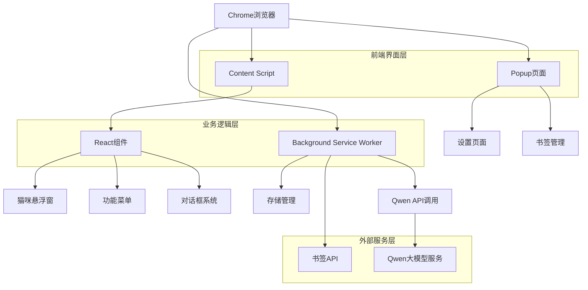

## 1. 架构设计



## 2. 技术描述

- **前端**: React@18 + TypeScript + Vite
- **初始化工具**: vite-init
- **样式方案**: CSS Modules + 像素风格设计
- **动画库**: Framer Motion（轻量级动画）
- **状态管理**: React Context + useReducer
- **存储**: Chrome Storage API + IndexedDB
- **构建工具**: Vite + Chrome Extension Manifest V3

### 核心依赖包：
```json
{
  "dependencies": {
    "react": "^18.2.0",
    "react-dom": "^18.2.0",
    "framer-motion": "^10.16.0"
  },
  "devDependencies": {
    "@types/chrome": "^0.0.246",
    "@types/react": "^18.2.0",
    "@types/react-dom": "^18.2.0",
    "@vitejs/plugin-react": "^4.0.0",
    "vite": "^4.4.0",
    "typescript": "^5.0.0"
  }
}
```

## 3. 路由定义

| 路由 | 目的 |
|-------|---------|
| content-script.js | 内容脚本，注入猫咪悬浮窗到网页 |
| popup.html | 插件弹出页面，设置和配置 |
| background.js | 后台服务，处理书签和API调用 |
| options.html | 扩展选项页面（备用） |

## 4. Chrome Extension 架构

### 4.1 Manifest V3 配置
```json
{
  "manifest_version": 3,
  "name": "CAT_CAT",
  "version": "1.0.0",
  "description": "可爱的猫咪助手，帮你管理书签和AI总结页面",
  "permissions": [
    "bookmarks",
    "storage",
    "activeTab",
    "scripting"
  ],
  "host_permissions": [
    "https://api.qwen.com/*"
  ],
  "content_scripts": [
    {
      "matches": ["<all_urls>"],
      "js": ["content-script.js"],
      "css": ["content.css"]
    }
  ],
  "background": {
    "service_worker": "background.js"
  },
  "action": {
    "default_popup": "popup.html",
    "default_icon": {
      "16": "icon16.png",
      "48": "icon48.png",
      "128": "icon128.png"
    }
  }
}
```

### 4.2 消息传递机制
```typescript
// 消息类型定义
interface CatMessage {
  type: 'BOOKMARK_ADD' | 'BOOKMARK_GET' | 'AI_SUMMARY' | 'AI_ASSOCIATION' | 'SETTINGS_UPDATE';
  payload?: any;
}

// Content Script 通信
chrome.runtime.sendMessage({
  type: 'BOOKMARK_ADD',
  payload: { url: window.location.href, title: document.title }
});

// Background Script 处理
chrome.runtime.onMessage.addListener((message: CatMessage, sender, sendResponse) => {
  switch (message.type) {
    case 'BOOKMARK_ADD':
      handleBookmarkAdd(message.payload);
      break;
    case 'AI_SUMMARY':
      handleAISummary(message.payload);
      break;
  }
});
```

## 5. 数据模型

### 5.1 存储结构
```typescript
// 插件设置
interface CatSettings {
  apiKey: string;
  restReminder: {
    enabled: boolean;
    interval: number; // 分钟
  };
  appearance: {
    size: 'small' | 'medium' | 'large';
    position: { x: number; y: number };
    animations: boolean;
  };
}

// 书签数据
interface BookmarkData {
  id: string;
  title: string;
  url: string;
  folderId: string;
  createdAt: number;
}

// AI总结结果
interface AISummaryResult {
  url: string;
  title: string;
  summary: string;
  keyPoints: string[];
  timestamp: number;
}

// 页面联想结果
interface AIAssociationResult {
  url: string;
  associations: {
    title: string;
    url: string;
    relevance: number;
    description: string;
  }[];
}
```

### 5.2 Chrome Storage 使用
```typescript
// 存储管理
class StorageManager {
  static async getSettings(): Promise<CatSettings> {
    const result = await chrome.storage.sync.get(['settings']);
    return result.settings || this.getDefaultSettings();
  }

  static async saveSettings(settings: CatSettings): Promise<void> {
    await chrome.storage.sync.set({ settings });
  }

  static async getBookmarkHistory(): Promise<BookmarkData[]> {
    const result = await chrome.storage.local.get(['bookmarks']);
    return result.bookmarks || [];
  }
}
```

## 6. Qwen API 集成

### 6.1 API 调用封装
```typescript
class QwenAPI {
  private apiKey: string;
  private baseURL: string = 'https://api.qwen.com/v1';

  constructor(apiKey: string) {
    this.apiKey = apiKey;
  }

  async summarizePage(content: string, url: string): Promise<AISummaryResult> {
    const prompt = `请总结以下网页内容，提供简洁的摘要和3-5个关键点：\n\n${content}`;
    
    const response = await fetch(`${this.baseURL}/completions`, {
      method: 'POST',
      headers: {
        'Authorization': `Bearer ${this.apiKey}`,
        'Content-Type': 'application/json'
      },
      body: JSON.stringify({
        model: 'qwen-turbo',
        prompt: prompt,
        max_tokens: 500,
        temperature: 0.7
      })
    });

    return this.parseSummaryResponse(await response.json());
  }

  async getAssociations(content: string, url: string): Promise<AIAssociationResult> {
    const prompt = `基于以下内容推荐相关的网页链接：\n\n${content}`;
    
    // 类似实现...
  }
}
```

### 6.2 错误处理和重试
```typescript
class APIRetryHandler {
  static async withRetry<T>(
    fn: () => Promise<T>, 
    maxRetries: number = 3,
    delay: number = 1000
  ): Promise<T> {
    for (let i = 0; i < maxRetries; i++) {
      try {
        return await fn();
      } catch (error) {
        if (i === maxRetries - 1) throw error;
        await new Promise(resolve => setTimeout(resolve, delay * Math.pow(2, i)));
      }
    }
    throw new Error('Max retries exceeded');
  }
}
```

## 7. 组件架构

### 7.1 React 组件结构
```typescript
// 主悬浮窗组件
const CatWidget: React.FC = () => {
  const [isHovered, setIsHovered] = useState(false);
  const [currentDialog, setCurrentDialog] = useState<string>('');
  const [position, setPosition] = useState({ x: 100, y: 100 });

  return (
    <div 
      className="cat-widget"
      style={{ left: position.x, top: position.y }}
      onMouseEnter={() => setIsHovered(true)}
      onMouseLeave={() => setIsHovered(false)}
    >
      <CatSprite animation={getIdleAnimation()} />
      {isHovered && <FunctionMenu />}
      {currentDialog && <DialogBox text={currentDialog} />}
    </div>
  );
};

// 功能菜单组件
const FunctionMenu: React.FC = () => {
  const [showEasterEgg, setShowEasterEgg] = useState(false);

  const handleFunctionClick = (func: string) => {
    if (Math.random() < 0.1) {
      setShowEasterEgg(true);
      return;
    }
    // 正常功能处理
  };

  return (
    <div className="function-menu">
      <button onClick={() => handleFunctionClick('bookmark')}>📚 书签</button>
      <button onClick={() => handleFunctionClick('ai')}>🤖 AI助手</button>
      <button onClick={() => handleFunctionClick('rest')}>⏰ 休息</button>
      {showEasterEgg && <EasterEggDialog />}
    </div>
  );
};
```

### 7.2 动画系统
```typescript
// 猫咪动画控制器
class CatAnimationController {
  private animations = {
    idle: ['blink', 'tail_wag', 'stretch'],
    happy: ['bounce', 'spin'],
    sad: ['shake', 'look_away'],
    busy: ['tap_foot', 'sigh']
  };

  getRandomAnimation(mood: CatMood): string {
    const availableAnimations = this.animations[mood];
    return availableAnimations[Math.floor(Math.random() * availableAnimations.length)];
  }
}

// 对话框动画
const DialogBox: React.FC<{ text: string }> = ({ text }) => {
  return (
    <motion.div
      className="dialog-box"
      initial={{ opacity: 0, scale: 0.8 }}
      animate={{ opacity: 1, scale: 1 }}
      exit={{ opacity: 0, scale: 0.8 }}
      transition={{ duration: 0.3 }}
    >
      <div className="dialog-tail" />
      <div className="dialog-content">{text}</div>
    </motion.div>
  );
};
```

## 8. 性能优化

### 8.1 资源管理
- 使用 WebP 格式图标，减少文件大小
- 实现组件懒加载，按需加载功能模块
- 使用 requestIdleCallback 处理非关键任务

### 8.2 内存管理
- 及时清理事件监听器和定时器
- 使用 WeakMap 管理DOM引用
- 实现虚拟滚动处理大量书签数据

### 8.3 错误边界
```typescript
class CatErrorBoundary extends React.Component<
  { children: React.ReactNode },
  { hasError: boolean }
> {
  state = { hasError: false };

  static getDerivedStateFromError() {
    return { hasError: true };
  }

  componentDidCatch(error: Error) {
    console.error('Cat Widget Error:', error);
    // 发送错误报告
  }

  render() {
    if (this.state.hasError) {
      return <div className="error-cat">猫咪遇到了问题~</div>;
    }
    return this.props